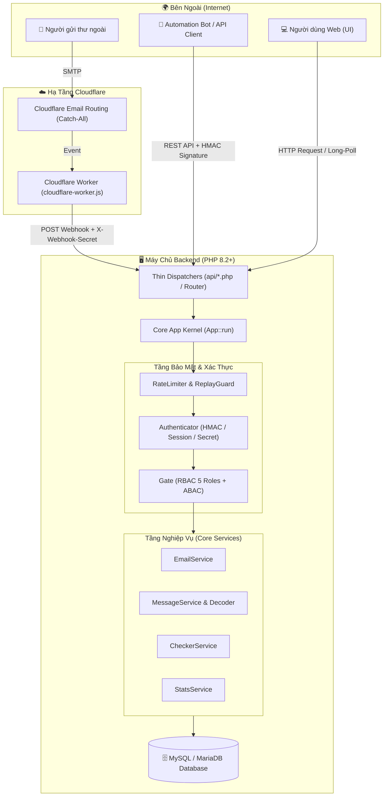

# 📬 KaiMail — Nền Tảng Temporary Mail Chuẩn Enterprise

<p align="center">
  
</p>

<p align="center">
  <strong>Hệ thống email tạm thời (Disposable Temporary Mail) hiệu năng cao, bảo mật đa tầng, tối ưu cho Developer, Automation Bot và môi trường chịu tải lớn.</strong>
</p>

<p align="center">
  <a href="https://php.net"></a>
  <a href="https://mariadb.org"></a>
  <a href="https://workers.cloudflare.com"></a>
  <a href="docs/SECURITY.md"></a>
  <a href="docs/API.md"></a>
  <a href="docs/ASSETS.md"></a>
</p>

---

## 🌟 Tổng Quan Dự Án (Executive Summary)

**KaiMail (Cloudflare_TMail)** là giải pháp toàn diện cho việc tiếp nhận, xử lý và phân phối thư điện tử tạm thời theo thời gian thực. Hệ thống được kiến trúc theo chuẩn **Clean Layered Architecture**, kết hợp cơ chế nạp lớp tự động **PSR-4**, container dịch vụ hướng dependency injection, xác thực chữ ký điện tử mật mã học **HMAC-SHA256**, và quy trình nạp thư tức thì từ **Cloudflare Email Routing & Workers**.

Không sử dụng các framework cồng kềnh, toàn bộ phần lõi (Core) được xây dựng thuần PHP 8.2+ với zero-overhead, phản hồi API dưới **30ms**, tối ưu hóa bộ nhớ và triệt tiêu hoàn toàn rủi ro xung đột cache trình duyệt nhờ pipeline **Content Hashing**.

---

## 📑 Danh Mục Tài Liệu Kỹ Thuật Chuyên Sâu

| Tài liệu | Trọng tâm nội dung |
|---|---|
| 🏛️ **[ARCHITECTURE.md](docs/ARCHITECTURE.md)** | Chi tiết kiến trúc phân tầng, vòng đời Request qua Kernel `App::run()`, container dịch vụ, PSR-4 Autoloading và bộ tối ưu hóa CSDL runtime. |
| 🚀 **[API.md](docs/API.md)** | Đặc tả API toàn diện: Thuật toán ký số HMAC-SHA256 (kèm code mẫu Python, Node.js), Webhook Ingestion, Long-polling, và RESTful Admin API. |
| 🛡️ **[SECURITY.md](docs/SECURITY.md)** | Mô hình phân quyền kép (RBAC 5 cấp độ + ABAC chính chủ), Cổng kiểm soát Gate, Replay Attack Guard với Nonce cache, và Atomic Rate Limiter. |
| ⚙️ **[SETUP.md](docs/SETUP.md)** | Hướng dẫn triển khai Production từng bước: Cấu hình `.env`, Nginx/Apache vhost, di chuyển CSDL, và tích hợp Cloudflare Worker script. |
| 📦 **[ASSETS.md](docs/ASSETS.md)** | Kiến trúc quản lý tài nguyên frontend: Content Hashing (SHA-256), Minification, Manifest Router, và chính sách Immutable Caching 1 năm. |

---

## ⚡ Tính Năng Cốt Lõi (Key Highlights)

### 1. Ingestion Tốc Độ Cao Qua Cloudflare Worker
- Đón toàn bộ luồng thư từ Cloudflare Email Routing theo mô hình Catch-All.
- Cloudflare Worker (`cloudflare-worker.js`) phân tích MIME, giải mã RFC 2047 & Quoted-Printable, sau đó đẩy an toàn vào Backend qua Webhook bảo mật bằng `X-Webhook-Secret`.

### 2. Bảo Mật Cấp Doanh Nghiệp (Enterprise Security)
- **Mô hình phân quyền kép (RBAC & ABAC)**: 5 vai trò rõ ràng (`ADMIN`, `API_USER`, `PUBLIC_USER`, `WEBHOOK`, `ANONYMOUS`) thẩm định qua `Gate::authorize()`.
- **Bảo vệ chống IDOR**: Khách vãng lai và Bot API chỉ được phép đọc tin nhắn thuộc sở hữu của chính họ.
- **Chống Replay Attack**: Header `X-API-NONCE` kết hợp kiểm tra lệch thời gian (`X-API-TIMESTAMP` $\pm$ 300s) với bộ nhớ đệm Nonce tự dọn rác.
- **Rate Limiting nguyên tử**: Giới hạn tần suất request bằng cơ chế Atomic File-Locking (`flock`) chống race-condition.

### 3. API Ký Số HMAC-SHA256 Thân Thiện Với Bot Automation
- Ngăn chặn hoàn toàn việc giả mạo gói tin hoặc giả lập bot.
- Hỗ trợ cả hai phong cách gọi: **RESTful Resource Routes** (`api/index.php`) và **Thin Dispatchers** (`api/*.php`) tương thích ngược 100%.

### 4. Realtime Long-Polling Không Cần Daemon
- Cơ chế Long-Polling non-blocking giữ kết nối HTTP tối đa 25 giây, trả về ngay khi có thư mới.
- Không phát sinh gánh nặng tài nguyên duy trì WebSocket Daemon hay Node.js server phụ trợ.

### 5. Frontend Siêu Nhẹ & Asset Pipeline Hiện Đại
- Giao diện người dùng thuần túy (Vanilla JS & CSS hiện đại, thiết kế Glassmorphic mượt mà).
- Tự động nén minified và băm nội dung (`[name].[hash].min.[ext]`). Trình duyệt tự nạp file mới ngay khi build mà không cần yêu cầu người dùng xóa cache.

---

## 🏗️ Sơ Đồ Luồng Dữ Liệu Toàn Hệ Thống (System Flow)



---

## 🗺️ Bản Đồ Cấu Trúc Mã Nguồn (Source Tree)

Toàn bộ logic nghiệp vụ cốt lõi được đóng gói hướng dịch vụ trong thư mục `includes/Core/`:

```text
c:/xampp/htdocs/tmail/
├── adminkaishop/                # Giao diện trang quản trị Admin độc lập
│   └── index.php                # Entrypoint dashboard quản trị
├── api/                         # Thin Dispatchers (1 dòng gọi Kernel)
│   ├── admin/                   # Dispatcher riêng cho các tác vụ quản trị
│   ├── webhook/
│   │   └── receive-email.php    # Điểm tiếp nhận thư từ Cloudflare Worker
│   ├── emails.php               # Quản lý tạo/xóa/đọc danh sách email
│   ├── messages.php             # Quản lý đọc/xóa thư
│   ├── long-poll.php            # Long-polling chờ thư mới realtime
│   └── index.php                # RESTful router tự động ánh xạ URL
├── assets/                      # Hình ảnh, biểu tượng tĩnh
├── cloudflare-worker.js         # Script Worker chạy trên Cloudflare Edge
├── config/                      # Cấu hình môi trường & cơ sở dữ liệu
├── css/                         # Mã nguồn CSS gốc (chưa build)
├── docs/                        # 📚 Hệ thống tài liệu kỹ thuật chuyên sâu
│   ├── API.md
│   ├── ARCHITECTURE.md
│   ├── ASSETS.md
│   ├── SECURITY.md
│   └── SETUP.md
├── includes/
│   └── Core/                    # 🧠 Trung tâm điều hành kiến trúc Clean Layered
│       ├── App.php              # Application Kernel & Service Container
│       ├── bootstrap.php        # SPL Autoloader chuẩn PSR-4
│       ├── Auth/                # Hệ thống định danh & kiểm soát quyền hạn
│       │   ├── Role.php         # Enum 5 vai trò (ADMIN, API_USER, ...)
│       │   ├── Permission.php   # Danh bạ quyền hạn tập trung
│       │   ├── AuthContext.php  # Context danh tính bất biến của request
│       │   ├── Authenticator.php# Xác thực HMAC, Session, Webhook Secret
│       │   └── Gate.php         # Cổng kiểm duyệt quyền hạn tập trung
│       ├── Controllers/         # Bộ điều hướng xử lý HTTP Request
│       ├── Database/            # Tối ưu hóa chỉ mục CSDL tự động (Optimizer)
│       ├── Http/                # Đóng gói Request, Response & ApiException
│       ├── Security/            # Atomic RateLimiter & ReplayGuard
│       └── Services/            # Các Domain Service thuần nghiệp vụ
├── js/                          # Mã nguồn JavaScript gốc (chưa build)
├── scripts/                     # Tool biên dịch và nén tài nguyên
│   ├── build.mjs                # Script build Node.js (nén CSS/JS + hash SHA-256)
│   └── build.php                # Script build PHP thuần dự phòng (zero-node)
├── static/                      # Tài nguyên Production đã qua build pipeline
│   ├── css/                     # CSS đã nén và gắn content hash
│   ├── js/                      # JS đã nén và gắn content hash
│   └── manifest.json            # Bản đồ ánh xạ tài nguyên cho Frontend
├── storage/                     # Bộ nhớ đệm tạm, khóa rate-limit, log
├── .env.example                 # Mẫu cấu hình môi trường
├── data.sql                     # Bản thiết kế lược đồ cơ sở dữ liệu
├── index.php                    # Giao diện người dùng chính (Web Client)
└── package.json                 # Cấu hình script npm
```

---

## 🚀 Hướng Dẫn Cài Đặt Nhanh (Quick Start)

### 1. Yêu Cầu Môi Trường
- **PHP**: $\ge 8.2$ (yêu cầu extensions: `pdo_mysql`, `openssl`, `mbstring`, `json`).
- **MySQL / MariaDB**: $\ge 5.7$ hoặc MariaDB $\ge 10.3$.
- **Web Server**: Apache với `mod_rewrite` hoặc Nginx.
- **Node.js** (Tùy chọn): Phiên bản LTS nếu muốn sử dụng `npm run build`.

### 2. Cài Đặt Bước-Theo-Bước

#### Bước 1: Khởi Tạo Tệp Môi Trường
```bash
cp .env.example .env
```
Mở tệp `.env` và thiết lập các thông số bảo mật:
```ini
DB_HOST=127.0.0.1
DB_PORT=3306
DB_NAME=kaimail
DB_USER=root
DB_PASS=MatKhauDatabaseCuaBan

BASE_URL=https://kaishop.id.vn
ADMIN_ACCESS_KEY=TaoChuoiHexDaiToiThieu32KyTuChoAdmin
API_ACCESS_KEY=TaoAccessKeyDai64KyTuChoBot
API_SECRET_KEY=TaoSecretKeyDai64KyTuChoHMAC
WEBHOOK_SECRET=TaoWebhookSecretKetNoiVoiCloudflare
```

#### Bước 2: Nhập Cơ Sở Dữ Liệu
```bash
mysql -u root -p kaimail < data.sql
```
*(Lưu ý: Bộ `DatabaseOptimizer` trong hệ thống sẽ tự động rà soát và bổ sung các composite index cần thiết lúc runtime nếu phát hiện còn thiếu).*

#### Bước 3: Biên Dịch Tài Nguyên (Asset Pipeline)
Bạn có thể lựa chọn 1 trong 2 cách:
```bash
# Cách 1: Sử dụng Node.js (khuyến nghị)
npm run build

# Cách 2: Sử dụng PHP thuần (không cần cài đặt Node.js)
npm run build:php
```

#### Bước 4: Triển Khai Cloudflare Worker
1. Sao chép nội dung tệp [cloudflare-worker.js](cloudflare-worker.js) vào Cloudflare Workers.
2. Thêm các biến môi trường (Secrets) trên Worker:
   - `BACKEND_WEBHOOK_URL`: `https://your-domain.com/api/webhook/receive-email.php`
   - `WEBHOOK_SECRET`: Giá trị khớp với `WEBHOOK_SECRET` trong file `.env`.
3. Cấu hình **Cloudflare Email Routing** $\rightarrow$ Thiết lập **Catch-all** trỏ action về Worker vừa tạo.

---

## 📡 Tổng Hợp Endpoint API

Toàn bộ phản hồi API được định dạng chuẩn JSON: `{ "success": true|false, "data": ..., "error": ... }`.

### 1. Public API (Dành Cho Web Client)
| Phương thức | Đường dẫn | Chức năng | Phân quyền |
|---|---|---|---|
| `POST` | `/api/emails.php` | Tạo 1 hộp thư ngẫu nhiên hoặc theo tên | `PUBLIC_USER` |
| `GET` | `/api/messages.php?email={email}` | Lấy danh sách tin nhắn của hộp thư | `PUBLIC_USER` (Chính chủ) |
| `GET` | `/api/messages.php?id={id}&email={email}` | Đọc chi tiết nội dung tin nhắn | `PUBLIC_USER` (Chính chủ) |
| `GET` | `/api/long-poll.php?email={email}&last_id={id}` | Chờ tin nhắn mới realtime (tối đa 25s) | `PUBLIC_USER` (Chính chủ) |

### 2. Automation Bot API (Yêu cầu chữ ký HMAC-SHA256)
Bắt buộc gửi kèm 4 headers: `X-API-KEY`, `X-API-TIMESTAMP`, `X-API-NONCE`, `X-API-SIGNATURE`. Chi tiết công thức tính chữ ký xem tại **[API.md](docs/API.md)**.

| Phương thức | Đường dẫn | Chức năng | Phân quyền |
|---|---|---|---|
| `POST` | `/api/emails.php` | Tạo hàng loạt 10 email cùng lúc | `API_USER` |
| `GET` | `/api/messages.php?email={email}` | Lấy danh sách tin nhắn tự động | `API_USER` |

### 3. Ingestion Webhook (Cloudflare Worker)
| Phương thức | Đường dẫn | Header xác thực | Chức năng |
|---|---|---|---|
| `POST` | `/api/webhook/receive-email.php` | `X-Webhook-Secret` | Nạp email mới vào hệ thống từ Worker |

---

## 🔒 Đặc Tả An Toàn & Bảo Mật

- **Zero Direct SQL Injection**: 100% truy vấn dữ liệu sử dụng PDO Prepared Statements và bind tham số chặt chẽ.
- **XSS Sanitization & Safe HTML Rendering**: Nội dung HTML của email được cô lập hiển thị qua `iframe` với thuộc tính `sandbox="allow-popups"` và lọc các thuộc tính/thẻ độc hại.
- **Timing-Attack Resistance**: Kiểm tra so khớp Secret Key, API Key và Session Token thông qua hàm an toàn `hash_equals()`.
- **Atomic Concurrency Protection**: Ngăn ngừa race-condition khi ghi cache hoặc kiểm tra rate limit bằng `flock(LOCK_EX)`.

---

## 🛠️ Công Nghệ Sử Dụng (Tech Stack)

| Thành phần | Công nghệ lựa chọn |
|---|---|
| **Backend Core** | PHP 8.2+ (Clean Architecture, Service Container, PSR-4 Autoloading) |
| **Database** | MySQL 5.7+ / MariaDB 10.3+ (InnoDB, Composite Indexes, FULLTEXT Index) |
| **Serverless Ingestion** | Cloudflare Workers + Cloudflare Email Routing (V8 Runtime) |
| **Frontend** | Vanilla JavaScript (ES6+), Vanilla CSS (Custom Properties, Glassmorphism) |
| **Asset Pipeline** | Custom ES/Node.js & Pure PHP Minifier with SHA-256 Cache-Busting |
| **Testing & Tools** | Visual Studio Code, XAMPP, Postman, Git |

---

## 📄 Bản Quyền & Giấy Phép (License)

Dự án được phát triển và vận hành bởi **KaiShop**. Toàn bộ mã nguồn và tài liệu kỹ thuật thuộc quyền sở hữu của dự án. Mọi hành vi tái phân phối cần tuân thủ các điều khoản nội bộ.
