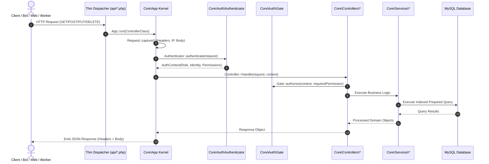

# Kiến Trúc Hệ Thống KaiMail (Architecture)

## 1. Triết Lý Thiết Kế (Design Philosophy)

Hệ thống KaiMail được xây dựng theo mô hình **Clean Layered Architecture** chuẩn mực của Senior Engineer:
- **Tách bạch hoàn toàn trách nhiệm (Separation of Concerns)**: Tầng HTTP (Request/Response) độc lập với tầng nghiệp vụ (Domain Services) và cơ sở dữ liệu.
- **Dependency Injection & Service Container**: Toàn bộ Services được quản lý tập trung trong [App.php](../includes/Core/App.php), tái sử dụng kết nối PDO duy nhất qua Lazy Loading.
- **Fail-Safe & Exception Handling**: Sử dụng [ApiException](../includes/Core/Http/ApiException.php) để chuẩn hóa mã trạng thái HTTP (400, 401, 403, 404, 429) và thông điệp lỗi dạng JSON, loại bỏ hoàn toàn các lỗi crash PHP không mong muốn.
- **Tương thích cơ sở dữ liệu chuẩn ANSI**: Sử dụng các câu lệnh SQL portable (`SUBSTR`, parameterized queries), hoạt động trơn tru trên cả MySQL, MariaDB và SQLite (In-memory testing).

---

## 2. Vòng Đời Của Request (Request Lifecycle)

Tất cả các yêu cầu từ Web UI, Bot, hoặc Cloudflare Worker đều đi qua cổng thực thi chuẩn hóa [App::run()](../includes/Core/App.php):



---

## 3. Chi Tiết Các Tầng Trong `includes/Core/`

### 3.1. Kernel & PSR-4 Autoloading
- **`bootstrap.php`**: Khởi tạo SPL Autoloader tự động nạp bất kỳ class nào có tiền tố `KaiMail\Core\` mà không cần dùng `require_once` thủ công.
- **`App.php`**:
  - `App::boot()`: Nạp cấu hình `.env`, khởi tạo kết nối CSDL và kích hoạt [DatabaseOptimizer](../includes/Core/Database/DatabaseOptimizer.php).
  - `App::getService($class)`: Service container quản lý singleton cho các Domain Service.
  - `App::makeController($class)`: Factory tự động tiêm các service phụ thuộc vào constructor của Controller.
  - `App::run($controllerClass)`: Điểm vào duy nhất điều phối toàn bộ vòng đời Request, tự động xử lý CORS, Preflight OPTIONS, phân quyền và bắt lỗi ngoại lệ.

### 3.2. HTTP Layer
- **`Request.php`**: Đóng gói đối tượng HTTP Request bất biến. Trích xuất chính xác địa chỉ IP người dùng thực tế thông qua các header proxy (`CF-Connecting-IP`, `X-Forwarded-For`), đọc raw body để phục vụ kiểm tra chữ ký HMAC, và hỗ trợ phương thức ghi đè (`X-HTTP-Method-Override`).
- **`Response.php`**: Đóng gói JSON Response với các header bảo mật: `Cache-Control: no-store, no-cache, must-revalidate`, CORS linh hoạt theo `BASE_URL`, và các header rate-limit RFC.
- **`ApiException.php`**: Lớp Exception nghiệp vụ mang theo mã HTTP Status Code và mã lỗi định danh.

### 3.3. Security & Auth Layer
- **`Role.php`**: Khai báo 5 vai trò hệ thống: `ADMIN`, `API_USER`, `PUBLIC_USER`, `WEBHOOK`, `ANONYMOUS`.
- **`Permission.php`**: Bảng ánh xạ quyền tập trung (RBAC).
- **`AuthContext.php`**: Đối tượng đại diện cho phiên làm việc hiện tại, mang theo vai trò, danh tính và danh sách quyền đã cấp.
- **`Gate.php`**: Cổng thẩm định quyền hạn tập trung (`Gate::authorize`). Chặn đứng truy cập trái phép bằng ngoại lệ `403 Forbidden`.
- **`Authenticator.php`**: Bộ nhận diện danh tính thông minh đa phương thức:
  1. Admin Session / Key
  2. Webhook Secret từ Cloudflare Worker
  3. Chữ ký số HMAC-SHA256 (Timestamp + Nonce)
  4. Web UI Session Token + Same-Origin
- **`RateLimiter.php`**: Giới hạn tốc độ gửi request bằng khóa file nguyên tử (`LOCK_EX`), bảo vệ server khỏi tấn công từ chối dịch vụ.
- **`ReplayGuard.php`**: Lưu vết chuỗi Nonce ngẫu nhiên có TTL (300 giây) để chống tấn công phát lại.

### 3.4. Domain Services Layer
- **`EmailService.php`**: Nghiệp vụ quản lý email (tạo đơn, tạo hàng loạt theo ngôn ngữ `en`/`vn`/`custom`, phân loại nguồn `admin`/`api`/`user`, quản lý ghi chú `note`, lọc theo trạng thái `is_done`, phân trang, xóa).
- **`MessageService.php`**: Nghiệp vụ lưu trữ thư đến, tự động nhận diện thương hiệu người gửi (Brand heuristics), tự động giải mã Quoted-Printable, lọc thư trùng theo `message_id`.
- **`DomainService.php`**: Nghiệp vụ quản lý danh sách tên miền, tự động kiểm tra ràng buộc toàn vẹn dữ liệu (chặn xóa tên miền nếu đang có email trực thuộc).
- **`StatsService.php`**: Tổng hợp số liệu tổng quan của hệ thống (phân luồng Admin / API / Khách) và thống kê trong 7 ngày gần nhất.
- **`CheckerService.php`**: Bộ lọc tin nhắn nhanh cho Admin bằng FULLTEXT Search trên `subject` và `body_text`.
- **`NameGenerator.php`**: Thuật toán sinh username tự nhiên kết hợp danh sách họ tên tiếng Anh / tiếng Việt với chữ số ngẫu nhiên.
- **`EmailDecoder.php`**: Bộ giải mã MIME Header (RFC 2047) và Quoted-Printable.

---

## 4. Cơ Sở Dữ Liệu Thực Tế (Database Schema)

Cấu trúc cơ sở dữ liệu đồng bộ chuẩn mực 100% với tệp [data.sql](../data.sql):

```sql
-- 1. Quản lý tên miền email
CREATE TABLE IF NOT EXISTS `domains` (
    `id` INT AUTO_INCREMENT PRIMARY KEY,
    `domain` VARCHAR(255) NOT NULL UNIQUE,
    `is_active` TINYINT(1) DEFAULT 1,
    `created_at` TIMESTAMP DEFAULT CURRENT_TIMESTAMP,
    INDEX `idx_domain` (`domain`),
    INDEX `idx_active` (`is_active`)
) ENGINE=InnoDB DEFAULT CHARSET=utf8mb4 COLLATE=utf8mb4_unicode_ci;

-- 2. Quản lý hộp thư email
CREATE TABLE IF NOT EXISTS `emails` (
    `id` INT AUTO_INCREMENT PRIMARY KEY,
    `domain_id` INT NOT NULL,
    `email` VARCHAR(255) NOT NULL UNIQUE,
    `name_type` ENUM('vn', 'en', 'custom') DEFAULT 'en',
    `is_done` TINYINT(1) DEFAULT 0,
    `created_by` VARCHAR(20) DEFAULT 'user',
    `note` VARCHAR(500) NULL,
    `created_at` TIMESTAMP DEFAULT CURRENT_TIMESTAMP,
    FOREIGN KEY (`domain_id`) REFERENCES `domains`(`id`) ON DELETE CASCADE,
    INDEX `idx_email` (`email`),
    INDEX `idx_domain_id` (`domain_id`),
    INDEX `idx_created_by` (`created_by`)
) ENGINE=InnoDB DEFAULT CHARSET=utf8mb4 COLLATE=utf8mb4_unicode_ci;

-- 3. Quản lý tin nhắn email nhận được
CREATE TABLE IF NOT EXISTS `messages` (
    `id` INT AUTO_INCREMENT PRIMARY KEY,
    `email_id` INT NOT NULL,
    `from_email` VARCHAR(255) NOT NULL,
    `from_name` VARCHAR(255) DEFAULT '',
    `subject` VARCHAR(500) DEFAULT '(No subject)',
    `snippet` VARCHAR(255) DEFAULT '',
    `body_text` LONGTEXT,
    `body_html` LONGTEXT,
    `message_id` VARCHAR(255),
    `is_read` TINYINT(1) DEFAULT 0,
    `received_at` TIMESTAMP DEFAULT CURRENT_TIMESTAMP,
    FOREIGN KEY (`email_id`) REFERENCES `emails`(`id`) ON DELETE CASCADE,
    INDEX `idx_email_id` (`email_id`),
    INDEX `idx_received` (`received_at`),
    INDEX `idx_messages_email_received` (`email_id`, `received_at`),
    INDEX `idx_messages_email_read` (`email_id`, `is_read`),
    FULLTEXT KEY `idx_content_search` (`subject`, `body_text`)
) ENGINE=InnoDB DEFAULT CHARSET=utf8mb4 COLLATE=utf8mb4_unicode_ci;
```

### Ý nghĩa các trường nghiệp vụ quan trọng:
- **`emails.created_by`**: Phân loại nguồn tạo (`'admin'`, `'api'`, `'user'`), phục vụ phân luồng thẻ thống kê và các tab lọc trên Admin Dashboard.
- **`emails.note`**: Ghi chú lưu kèm từng email (hỗ trợ thêm khi tạo hoặc cập nhật inline qua modal).
- **`emails.is_done`**: Cờ nhị phân (0 = chưa dùng, 1 = đã dùng) phục vụ lọc nội bộ API.
- **`emails.name_type`**: Loại định danh tạo email (`'en'`, `'vn'`, hoặc `'custom'`).
- **`messages.snippet`**: Đoạn trích vắn tắt nội dung tin nhắn phục vụ render UI nhanh.
- **`messages.message_id`**: Định danh duy nhất của bức thư do máy chủ gửi sinh ra, dùng để chống trùng lặp thư khi Worker retry.
- **Composite Indexes**:
  - `idx_messages_email_received (email_id, received_at)`: Giúp câu lệnh query lấy thư mới nhất theo từng hộp thư và kết nối Long Polling đạt tốc độ thực thi O(log N).
  - `idx_content_search (subject, body_text)`: Chỉ mục toàn văn (FULLTEXT Index) phục vụ Fast Checker tìm OTP cực nhanh.
