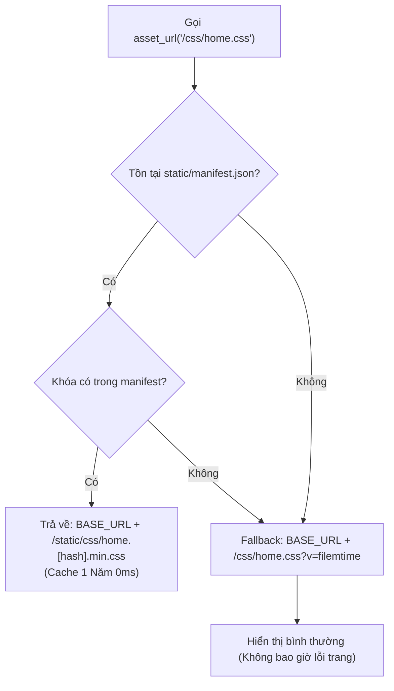

# Kiến Trúc Quản Lý Tài Nguyên & Cache Busting (Asset Pipeline)

Tài liệu này mô tả chi tiết cơ chế **Content Hashing**, **Minification**, và **Immutable Caching** chuẩn Enterprise được triển khai trên hệ thống KaiMail, giải quyết triệt để vấn đề xung đột cache trình duyệt khi triển khai sản phẩm lên Production.

---

## 1. Triết Lý Thiết Kế & Vấn Đề Cần Giải Quyết

### 1.1. Vấn nạn Cache Trình Duyệt trên Production
Trong các ứng dụng web truyền thống, trình duyệt thường lưu cache các tệp `.css` và `.js` để tăng tốc độ tải trang. Tuy nhiên:
- Khi lập trình viên cập nhật tính năng hoặc sửa lỗi, khách hàng cũ truy cập website vẫn tải phiên bản file CSS/JS cũ trong ổ cứng, dẫn đến **vỡ giao diện**, **lỗi logic JavaScript**, hoặc không nhận giao diện mới.
- Bắt khách hàng bấm `Ctrl + Shift + R` (xóa cache) là giải pháp tối kỵ trong trải nghiệm người dùng (UX).
- Sử dụng Query String (`style.css?v=1.0.1`) có nhược điểm: Một số CDN, Proxy trung gian hoặc trình duyệt mobile bỏ qua chuỗi query và tiếp tục cache tệp cũ.

### 1.2. Giải Pháp Chuẩn Công Nghiệp (Content Hashing + Immutable Caching)
Hệ thống KaiMail áp dụng mô hình phân phối tài nguyên tương tự các nền tảng lớn (Shopify, Next.js, Vercel):
1. **Nội dung quyết định tên file**: Mã băm (SHA-256, 10 ký tự) được tính toán trực tiếp từ nội dung đã nén của file và gắn vào tên tệp: `home.cfd215a304.min.css`.
2. **Cache vĩnh viễn (1 Năm)**: Thiết lập HTTP Header `Cache-Control: public, max-age=31536000, immutable`.
3. **Cập nhật tức thì (Zero-Cache Collision)**: Khi mã nguồn thay đổi, nội dung thay đổi $\rightarrow$ mã hash thay đổi $\rightarrow$ URL thay đổi hoàn toàn. Trình duyệt bắt buộc phải tải tệp mới ngay lập tức mà không cần xóa cache.

---

## 2. Cấu Trúc Thư Mục Tài Nguyên Đã Biên Dịch

Toàn bộ tài nguyên sau khi biên dịch được lưu trữ tập trung tại thư mục `static/`:

```text
static/
├── css/
│   ├── home.cfd215a304.min.css         <-- CSS Trang chủ (Nén -26.2%)
│   └── admin.7538597227.min.css        <-- CSS Admin Dashboard (Nén -27.9%)
├── js/
│   ├── app.3d93c15d68.min.js           <-- JS App chính (Quản lý hộp thư, OTP, 2FA)
│   ├── longPolling.32fa8e2a1f.min.js   <-- JS Long Polling thời gian thực
│   ├── admin.04251f9c48.min.js         <-- JS Core Admin Layout
│   ├── admin-dashboard.dc225ea623.min.js <-- JS Dashboard & Fast Checker
│   └── admin-login.7b23501321.min.js   <-- JS Xử lý đăng nhập Admin
└── manifest.json                       <-- Bảng ánh xạ định tuyến tài nguyên
```

### Bảng Ánh Xạ `static/manifest.json`
Tệp JSON này là "Single Source of Truth" để tầng Backend ánh xạ đường dẫn logic sang tệp hash thực tế:

```json
{
    "/css/home.css": "/static/css/home.cfd215a304.min.css",
    "/css/admin.css": "/static/css/admin.7538597227.min.css",
    "/js/app.js": "/static/js/app.3d93c15d68.min.js",
    "/js/longPolling.js": "/static/js/longPolling.32fa8e2a1f.min.js",
    "/js/admin.js": "/static/js/admin.04251f9c48.min.js",
    "/js/admin-dashboard.js": "/static/js/admin-dashboard.dc225ea623.min.js",
    "/js/admin-login.js": "/static/js/admin-login.7b23501321.min.js"
}
```

---

## 3. Bộ Build Script Đa Nền Tảng (Cross-Platform Compilers)

Dự án trang bị hai bộ công cụ biên dịch chạy song song, đảm bảo hoạt động hoàn hảo trên mọi môi trường:

### 3.1. Node.js Compiler: `scripts/build.mjs`
- **Mục đích**: Dành cho môi trường phát triển (Local Dev) và CI/CD có sẵn Node.js.
- **Cách chạy**:
  ```bash
  npm run build
  # Hoặc
  node scripts/build.mjs
  ```
- **Tính năng**:
  - Tự động dọn dẹp các tệp build cũ trong `static/css/` và `static/js/`.
  - Nén CSS: Loại bỏ chú thích, khoảng trắng thừa, nén bộ chọn.
  - Tự động viết lại đường dẫn tương đối (Path Rewriting): Đổi `../assets/` thành `../../assets/` để tài nguyên font/cursor/ảnh load chính xác từ thư mục con `static/css/`.
  - Nén JS: Loại bỏ chú thích và dòng trống an toàn.
  - Sinh mã hash SHA-256 10 ký tự và xuất ra `static/manifest.json`.

### 3.2. PHP Pure Compiler: `scripts/build.php`
- **Mục đích**: Dành cho máy chủ Production (Shared Hosting cPanel/DirectAdmin, VPS) không cài đặt Node.js/NPM.
- **Cách chạy**:
  ```bash
  php scripts/build.php
  ```
- **Tính năng**: Sử dụng 100% PHP thuần (hàm chuỗi, regex và `hash('sha256')`), không phụ thuộc vào bất kỳ thư viện bên ngoài nào (`vendor` hay `node_modules`).

---

## 4. Cơ Chế Phục Vụ & Fallback An Toàn (AssetService)

Được quản lý bởi lớp [AssetService.php](../includes/Core/Services/AssetService.php):



### 4.1. Hàm Trợ Giúp Toàn Cục `asset_url()`
Được nạp sẵn tại [bootstrap.php](../includes/Core/bootstrap.php). Sử dụng tiện lợi trong mọi file giao diện PHP:

```php
<!-- Nhúng CSS trang chủ -->
<link rel="stylesheet" href="<?= asset_url('/css/home.css') ?>">

<!-- Nhúng JavaScript -->
<script src="<?= asset_url('/js/app.js') ?>"></script>
```

### 4.2. Khả Năng Tự Phục Hồi (Self-Healing Fallback)
Nếu lập trình viên vô tình xóa thư mục `static/` hoặc chưa chạy build:
1. `AssetService` tự động phát hiện `manifest.json` không tồn tại.
2. Hệ thống chuyển sang cơ chế fallback: đọc tệp gốc trong `css/` hoặc `js/` và thêm tham số thời gian sửa file `?v=filemtime`.
3. **Cam kết**: Website hoạt động 100% bình thường, không bao giờ bị màn hình trắng hoặc lỗi 404.

---

## 5. Cấu Hình Máy Chủ Web (.htaccess) & Lý Do Cache 1 Năm

Tại tệp [.htaccess](../.htaccess), các quy tắc phân phối cache hiệu năng cao được thiết lập:

```apache
# 1. Bật hạn sử dụng 1 năm cho tài nguyên tĩnh
<IfModule mod_expires.c>
    ExpiresActive On
    ExpiresByType text/css "access plus 1 year"
    ExpiresByType application/javascript "access plus 1 year"
    ExpiresByType image/png "access plus 1 year"
    ExpiresByType image/jpeg "access plus 1 year"
    ExpiresByType image/svg+xml "access plus 1 year"
</IfModule>

# 2. Gắn cờ Immutable cho các tệp đã gắn mã hash
<IfModule mod_headers.c>
    <FilesMatch "\.(?:[a-f0-9]{8,12}\.min\.(?:css|js)|[a-f0-9]{8,12}\.(?:png|jpg|svg))$">
        Header set Cache-Control "public, max-age=31536000, immutable"
    </FilesMatch>
</IfModule>
```

### Tại Sao Lại Là 1 Năm (`max-age=31536000, immutable`)?

Nhiều người e ngại: *"Set cache 1 năm lỡ sửa code thì khách hàng bị kẹt giao diện cũ 1 năm à?"*
**Câu trả lời là KHÔNG BAO GIỜ!** Đây chính là sức mạnh tối thượng của kiến trúc **Content Hashing**:

1. **Chuẩn RFC 8246 & Google Web Vitals**: Con số `31536000` giây (365 ngày) là mức tối đa tiêu chuẩn cho tài nguyên bất biến.
2. **Cờ `immutable`**: Ra lệnh cho trình duyệt: *"File này không bao giờ bị thay đổi nội dung trong suốt vòng đời của nó. Đừng tốn công gửi request hỏi lại server (No 304 Revalidation) khi người dùng F5 hoặc chuyển trang."* Kết quả là tốc độ tải file đạt **0ms (from disk cache)**!
3. **Cơ Chế Bẻ Cache Tức Thì (Instant Cache Invalidation)**:
   - File CSS có tên: `home.cfd215a304.min.css`.
   - Khi bạn sửa dù chỉ 1 dòng CSS, mã SHA-256 đổi thành `home.9a8b7c6d5e.min.css`.
   - File HTML (`index.php`) **KHÔNG** bị cache bất biến. Khi người dùng mở trang, trình duyệt nhận HTML mới có chứa đường dẫn file mới.
   - Vì đường dẫn file hoàn toàn mới, trình duyệt coi đây là một tài nguyên chưa từng thấy và lập tức tải ngay file mới về trong tích tắc!
   - **Tóm lại**: File cũ vẫn nằm trong cache nhưng không ai gọi tới nó nữa. File mới được nạp tức thì trong 0 giây, không cần khách hàng phải bấm `Ctrl + Shift + R`.

---

## 6. Quy Trình Triển Khai Trên Hosting (Deployment Workflow)

### Bước 1: Phát Triển & Đóng Gói Tại Local
```bash
# 1. Sửa code trong css/ và js/
# 2. Biên dịch nén và tạo hash
npm run build
# (Hoặc: php scripts/build.php)

# 3. Đẩy lên GitHub
git add .
git commit -m "feat: your updates"
git push origin main
```

---

### Bước 2: Triển Khai Lên Máy Chủ Hosting

Bạn có hai cách triển khai trên hosting (chọn cách phù hợp):

#### Cách A: Dùng Trực Tiếp Terminal Trên Hosting (Khuyên Dùng khi có SSH/Terminal)
Nếu Hosting của bạn (cPanel / DirectAdmin) có hỗ trợ tính năng **Terminal** trong bảng điều khiển:

1. Đăng nhập vào Control Panel của Hosting $\rightarrow$ Tìm và mở mục **Terminal** (hoặc SSH client như PuTTY, MobaXterm).
2. Chuyển vào thư mục chứa mã nguồn website:
   ```bash
   cd ~/public_html
   # Hoặc nếu là subdomain:
   cd /home/kaishopi/domains/tmail.kaishop.id.vn/public_html
   ```
3. Chạy 1 lệnh duy nhất để tự động kéo code và biên dịch assets:
   ```bash
   bash git_deploy.sh
   ```
   *(Script sẽ tự động kéo `git pull`, sau đó gọi `php scripts/build.php` để đóng gói assets sạch sẽ và in log trực tiếp ra màn hình terminal).*

4. **Hoặc chạy từng lệnh thủ công**:
   ```bash
   # Kéo code mới từ GitHub
   git pull origin main

   # Biên dịch assets bằng PHP thuần (không cần Node.js)
   php scripts/build.php

   # Kiểm tra bảng ánh xạ vừa tạo
   cat static/manifest.json
   ```

---

#### Cách B: Tự Động Triển Khai Bằng Cron Job (Không cần gõ lệnh)
Nếu bạn không muốn mỗi lần update phải mở terminal gõ lệnh:

1. Vào mục **Cron Jobs** trên trang quản trị Hosting (như hiển thị trong menu cPanel).
2. Thêm một Cron Job chạy định kỳ mỗi 2 đến 5 phút:
   ```bash
   /bin/bash /home/kaishopi/domains/tmail.kaishop.id.vn/public_html/git_deploy.sh
   ```
3. Mỗi khi bạn `git push` từ máy tính lên GitHub, trong vòng 2-5 phút máy chủ sẽ tự động `git pull` và chạy `php scripts/build.php`. Nhật ký triển khai được lưu lại tại `storage/logs/cron_deploy.log`.
