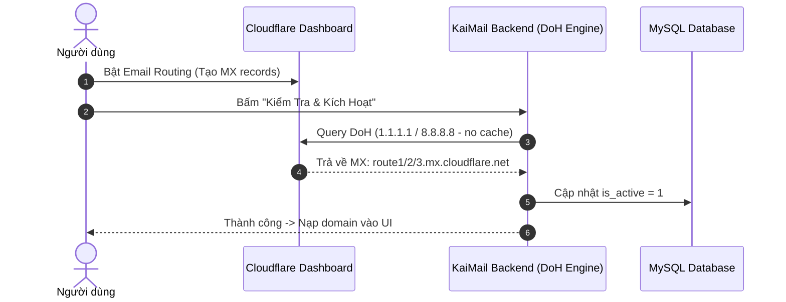

# Kiến Trúc Xác Thực & Giám Sát Custom Domain (KaiMail)

Tài liệu chi tiết về tiêu chuẩn kỹ thuật cấp Production (Senior Level) cho tính năng **Custom Domain Onboarding & Live Health Monitoring** trên hệ thống **KaiMail**.

---

## 1. Cơ Chế Realtime DoH Multi-Resolver (Chống Cache TTL)

### Vấn đề:
Khi người dùng thêm domain và bật Email Routing trên Cloudflare, các bản ghi DNS MX mới thường mất từ vài phút đến 24 giờ để lan truyền (propagation) tới máy chủ cục bộ nếu dùng resolver mặc định của hệ điều hành / hosting (bị kẹt DNS cache TTL).

### Giải pháp kỹ thuật:
Hệ thống sử dụng **DNS-over-HTTPS (DoH)** gọi trực tiếp tới 2 cụm DNS trung tâm:
1. **Cloudflare Core DNS:** `https://cloudflare-dns.com/dns-query` (`1.1.1.1`)
2. **Google Public DNS:** `https://dns.google/resolve` (`8.8.8.8`)

- Header: `Accept: application/dns-json`, `cache-control: no-cache`.
- Thời gian phát hiện: **Dưới 200ms** ngay khi user vừa bấm kích hoạt trên Cloudflare Dashboard.



---

## 2. Tiêu Chuẩn 3 Lớp Xác Thực (3-Layer Live Verification)

Khi người dùng gửi yêu cầu kích hoạt, hệ thống chạy 3 lớp kiểm tra nghiêm ngặt:

1. **MX Records Validation:**
   - Kiểm tra domain có chứa các bản ghi MX trỏ về mail server Cloudflare:
     - `*.mx.cloudflare.net` (ví dụ: `route1.mx.cloudflare.net`, `route2.mx.cloudflare.net`, `route3.mx.cloudflare.net`, `isaac.mx.cloudflare.net`, `linda.mx.cloudflare.net`, `amir.mx.cloudflare.net`)
     - `*.email.cloudflare.net`
   - Chặn tuyệt đối nếu MX trỏ về bên thứ ba (Google Workspace, Zoho, Microsoft 365, Mailgun,...) để tránh xung đột định tuyến.

2. **MX Priority Hierarchy:**
   - Bản ghi phải có đủ các mức ưu tiên chuẩn của Cloudflare Email Routing (Priority 1, 5, 10 hoặc tương đương).

3. **SPF Record (Anti-Spoofing):**
   - Kiểm tra bản ghi `TXT` định dạng: `v=spf1 include:_spf.mx.cloudflare.net ~all`.

---

## 3. Background Health Check (Giám Sát Định Kỳ Tự Động)

Trong thực tế vận hành SaaS, người dùng có thể:
- Hết hạn tên miền.
- Xóa domain trên Cloudflare.
- Đổi DNS MX sang nhà cung cấp khác.

Hệ thống cung cấp script background CLI & Cron Job:
[`scripts/check_domains_health.php`](file:///c:/xampp/htdocs/tmail/scripts/check_domains_health.php)

### Cấu hình Cron Job (Gợi ý chạy mỗi 6 tiếng):
```bash
0 0,6,12,18 * * * php /home/kaishopi/domains/tmail.kaishop.id.vn/public_html/scripts/check_domains_health.php >> /home/kaishopi/domains/tmail.kaishop.id.vn/public_html/storage/logs/domain_health.log 2>&1
```

### Xử lý thông minh (Auto-Remediation):
- **Nếu Domain Live:** Giữ nguyên `is_active = 1`. Nếu trước đó bị lỗi, tự động hồi phục lại trạng thái `ACTIVE`.
- **Nếu Domain Mất MX (Degraded / Dead):** Tự động chuyển `is_active = 0` và tạm ẩn khỏi danh sách dropdown trang chủ nhằm tránh người dùng tạo phải email hỏng không nhận được thư.

---

## 4. Bảng Chẩn Đoán Trạng Thái Live (Diagnostic Status Table)

| Trạng thái | Mã màu | Ý nghĩa kỹ thuật | Hành vi của hệ thống |
| :--- | :---: | :--- | :--- |
| **LIVE / HEALTHY** | 🟢 | MX trỏ đúng cụm Cloudflare, kết nối thông suốt | Cho phép tạo email & nhận thư realtime tức thì |
| **PENDING DNS** | 🟡 | Domain vừa thêm vào bước 1, chưa trỏ hoặc DNS đang phân giải | Hướng dẫn user tải worker.js và bật Email Routing |
| **DEGRADED / DEAD** | 🔴 | Mất bản ghi MX hoặc trỏ sang mail server khác | Tự động hạ trạng thái `is_active = 0` để bảo vệ hệ thống |
| **SYSTEM DOMAIN** | 🔵 | Domain gốc của hệ thống (ví dụ: `kaishop.id.vn`) | Luôn được bảo vệ, không thể bị ghi đè hoặc vô hiệu hóa nhầm |

---

## 5. Danh Sách Tệp Liên Quan Trong Codebase

- [`includes/Core/Services/CustomDomainService.php`](file:///c:/xampp/htdocs/tmail/includes/Core/Services/CustomDomainService.php): Service chính xử lý DoH, sinh mã Worker cá nhân hóa, check live DNS.
- [`api/custom-domains.php`](file:///c:/xampp/htdocs/tmail/api/custom-domains.php): Endpoint xử lý request `setup`, `verify`, `download-worker`.
- [`scripts/check_domains_health.php`](file:///c:/xampp/htdocs/tmail/scripts/check_domains_health.php): Script CLI / Cron giám sát sức khỏe toàn bộ custom domain.
- [`migrations/2026_09_07_custom_domain_support.sql`](file:///c:/xampp/htdocs/tmail/migrations/2026_09_07_custom_domain_support.sql): File migration CSDL cho bảng `domains`.
