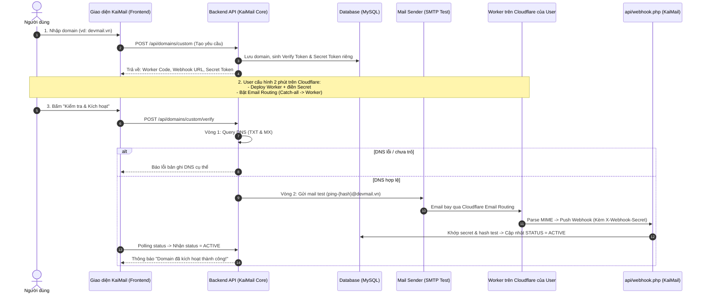

# Kế Hoạch Triển Khai Tính Năng: Thêm & Xác Thực Custom Domain (KaiMail)

Tài liệu thiết kế kiến trúc và lộ trình triển khai chi tiết cho phép người dùng/khách hàng tự tích hợp tên miền riêng (**Custom Domain**) vào hệ thống **KaiMail** thông qua **Cloudflare Email Routing + Cloudflare Worker**, cam kết đảm bảo **100% domain hoạt động thực tế** trước khi đưa vào khai thác.

---

## 1. Tổng Quan Kiến Trúc & Luồng Hoạt Động (Architecture Flow)

Vì **Cloudflare Email Routing** chỉ cho phép định tuyến email tới Cloudflare Worker nằm trong **cùng một tài khoản Cloudflare**, người dùng sẽ sở hữu Cloudflare Worker trung gian tại tài khoản của họ để parse email và đẩy (push) về Webhook trung tâm của KaiMail.



---

## 2. Cơ Chế Bảo Mật Đa Tầng (Multi-Tenant Security)

1. **Chống giả mạo Webhook (Domain-scoped Webhook Secret):**
   - Không sử dụng chung 1 Secret cố định cho tất cả user.
   - Mỗi domain tạo ra một chuỗi bí mật riêng dạng: `km_whsec_<32_bytes_hex>`.
   - Khi Worker gửi payload lên `api/webhook.php`, webhook tra cứu secret theo domain người nhận (`to`) và so khớp với `X-Webhook-Secret`.
2. **Chống chiếm quyền Domain (Ownership Challenge):**
   - Sinh chuỗi `verify_token` ngẫu nhiên.
   - Yêu cầu cấu hình bản ghi `TXT` hoặc dùng chính cơ chế End-to-End Live Ping để xác nhận người cấu hình sở hữu domain đó trên Cloudflare.
3. **Chống rác Inbox (Test Email Interceptor):**
   - Mail test tự động có header hoặc địa chỉ dạng: `verify-ping-{hash}@{domain}`.
   - Webhook khi nhận diện được email này sẽ chỉ dùng để đổi trạng thái `active` và **không lưu vào bảng tin nhắn công khai**.

---

## 3. Thiết Kế Cơ Sở Dữ Liệu (Database Schema)

Nâng cấp bảng `domains` (hoặc tạo bảng `custom_domains`):

```sql
-- Cập nhật hoặc tạo mới bảng domains
CREATE TABLE IF NOT EXISTS `custom_domains` (
  `id` INT UNSIGNED AUTO_INCREMENT PRIMARY KEY,
  `user_id` INT UNSIGNED NULL COMMENT 'ID người dùng/khách hàng nếu có hệ thống auth',
  `domain` VARCHAR(190) NOT NULL UNIQUE,
  `webhook_secret` VARCHAR(64) NOT NULL COMMENT 'Secret riêng gán vào Worker của domain',
  `verify_token` VARCHAR(64) NOT NULL COMMENT 'Token kiểm tra DNS TXT & Live Ping',
  `status` ENUM('pending_setup', 'checking_dns', 'testing_delivery', 'active', 'failed', 'suspended') DEFAULT 'pending_setup',
  `dns_txt_verified` TINYINT(1) DEFAULT 0,
  `dns_mx_verified` TINYINT(1) DEFAULT 0,
  `live_ping_verified` TINYINT(1) DEFAULT 0,
  `last_ping_at` DATETIME NULL,
  `last_dns_check_at` DATETIME NULL,
  `created_at` DATETIME DEFAULT CURRENT_TIMESTAMP,
  `updated_at` DATETIME DEFAULT CURRENT_TIMESTAMP ON UPDATE CURRENT_TIMESTAMP,
  INDEX `idx_domain_status` (`domain`, `status`)
) ENGINE=InnoDB DEFAULT CHARSET=utf8mb4 COLLATE=utf8mb4_unicode_ci;
```

---

## 4. Chi Tiết Các Bước Kỹ Thuật (Step-by-Step Implementation)

### Giai Đoạn 1: Nâng Cấp Webhook Nhận Mail (`api/webhook.php`)

- **Nhiệm vụ:**
  - Lấy domain từ trường `to` trong JSON request: `$recipientDomain = substr(strrchr($to, "@"), 1);`.
  - Tra cứu trong DB:
    - Nếu là domain hệ thống gốc $\rightarrow$ kiểm tra với `WEBHOOK_SECRET` trong `.env`.
    - Nếu là custom domain $\rightarrow$ kiểm tra với `webhook_secret` trong bảng `custom_domains`.
  - **Live Ping Handshake:** Nếu người nhận có dạng `verify-ping-{verify_token}@{domain}`:
    - Cập nhật `custom_domains SET status = 'active', live_ping_verified = 1, last_ping_at = NOW()`.
    - Phản hồi `200 OK {"status": "verified"}` và kết thúc (không chèn vào bảng messages).

---

### Giai Đoạn 2: Xây Dựng Bộ API Quản Lý Domain

Tạo controller / endpoints mới tại `api/custom_domains.php`:

| Method | Endpoint | Chức năng | Payload / Params |
| :--- | :--- | :--- | :--- |
| `POST` | `/api/custom_domains.php?action=create` | Đăng ký domain & sinh Secret/Token | `{"domain": "example.com"}` |
| `GET` | `/api/custom_domains.php?action=guide` | Lấy mã Worker & hướng dẫn setup | `{"domain_id": 12}` |
| `GET` | `/api/custom_domains.php?action=download_worker` | Tải trực tiếp file `worker.js` đã điền sẵn URL & Secret | `{"domain_id": 12}` |
| `POST` | `/api/custom_domains.php?action=check_dns` | Query DNS TXT/MX trực tiếp | `{"domain_id": 12}` |
| `POST` | `/api/custom_domains.php?action=test_ping` | Bắn email test qua SMTP ngầm | `{"domain_id": 12}` |
| `GET` | `/api/custom_domains.php?action=status` | Polling kiểm tra trạng thái kích hoạt | `{"domain_id": 12}` |
| `DELETE`| `/api/custom_domains.php?action=delete` | Xóa domain khỏi hệ thống | `{"domain_id": 12}` |

---

### Giai Đoạn 3: Công Cụ Kiểm Tra DNS & Gửi Mail Test (Backend Core)

1. **DNS Resolver Service (`includes/Core/Services/DnsVerifierService.php`):**
   - Query bản ghi `DNS_TXT` kiểm tra token `kaimail-verify={token}`.
   - Query bản ghi `DNS_MX` kiểm tra sự hiện diện của `*.mx.cloudflare.net` hoặc MX hợp lệ.
2. **Ping Dispatcher Service (`includes/Core/Services/MailPingService.php`):**
   - Tích hợp SMTP (PHPMailer hoặc lightweight SMTP socket) gửi email nội dung ngẫu nhiên đến: `verify-ping-{verify_token}@{domain}`.

---

### Giai Đoạn 4: Giao Diện Người Dùng Trên Trang Chủ (`index.php`)

Tích hợp trực tiếp vào Single Page App (SPA) tại trang chủ:
1. **Điểm kích hoạt (Triggers):**
   - **Trigger 1 (Toolbar):** Thêm nút `➕ Thêm Domain` bên cạnh các nút `Tùy chỉnh`, `Mã QR`, `Xóa`.
   - **Trigger 2 (Dropdown Tùy Chỉnh):** Trong modal "Tùy chỉnh email", ở danh sách chọn domain `@...`, dòng cuối cùng là: `➕ Thêm tên miền riêng của bạn...`.
2. **Modal Stepper 4 Bước Tương Tác:**
   ```
   [ 1. Nhập Domain ] ➔ [ 2. Tải/Copy Worker ] ➔ [ 3. Cài Email Routing ] ➔ [ 4. Test & Kích Hoạt ]
   ```
3. **Cung Cấp 2 Lựa Chọn Lấy Mã Worker:**
   - **Nút 1 - Sao chép mã (Copy Code):** 1-click copy toàn bộ nội dung script JavaScript.
   - **Nút 2 - Tải file (.js) trực tiếp (Download File):** Tải về file `cloudflare-worker.js` đã được tiêm (inject) sẵn `WEBHOOK_URL` và `WEBHOOK_SECRET` riêng của domain đó, user chỉ việc kéo thả vào Cloudflare.
4. **Trải nghiệm sau kích hoạt:**
   - Khi hoàn tất, modal tự đóng lại và tự động gán ngay domain vừa xác thực vào ô tạo Temp Mail.

---

### Giai Đoạn 5: Tuân Thủ Quy Chuẩn Asset Pipeline (`docs/ASSETS.md`)

- Mọi CSS mới cho Stepper/Modal được viết vào `css/home.css`.
- Mọi JS xử lý modal và polling được viết vào `js/app.js`.
- Sử dụng hàm `asset_url()` để load tài nguyên.
- Chạy `npm run build` (`scripts/build.mjs`) để tự động:
  - Terser AST Mangling biến cục bộ (`t, e, i...`).
  - Minify CSS/JS.
  - Sinh mã hash SHA-256 (10 ký tự) vào `static/manifest.json`.
  - Đảm bảo không bị dính cache trình duyệt trên Production.

---

### Giai Đoạn 5: Cron Job Tự Động Re-check & Bảo Trì

Tạo script `scripts/cron_check_domains.php`:
- Chạy định kỳ mỗi 6 giờ qua Task Scheduler (Windows) hoặc Crontab (Linux).
- Quét các domain đang `active`:
  - Nếu MX bị xóa hoặc chuyển trỏ sang server khác $\rightarrow$ Đổi trạng thái sang `suspended`.
  - Tránh tình trạng người dùng chọn domain nhưng không nhận được email do domain đã bị chết/hết hạn.

---

### Giai Đoạn 6: Trang Quản Lý Domain Dành Cho Admin (`adminkaishop/domains.php`)
## 5. Hướng Dẫn Cấu Hình Cloudflare Khi Dùng Tài Khoản Cloudflare Riêng (2 Bước)

Vì Cloudflare **không cho phép trỏ Email Routing sang Worker nằm ở tài khoản khác**, người dùng (sở hữu tài khoản Cloudflare riêng) sẽ thực hiện 2 bước đơn giản:

### Bước 1: Tạo Worker trên tài khoản Cloudflare của bạn
1. Truy cập [Workers & Pages](https://dash.cloudflare.com/?to=/:account/workers-and-pages) $\rightarrow$ Bấm **Create Application** $\rightarrow$ **Create Worker** (ví dụ đặt tên: `v-bridge` hoặc `kaimail-forwarder`) $\rightarrow$ Nhấn **Deploy**.
2. Nhấn **Edit Code** (hoặc Quick Edit) $\rightarrow$ Xóa toàn bộ mã mặc định.
3. Bấm nút **"Sao chép Code"** (hoặc mở file `cloudflare-worker.js` vừa tải về từ KaiMail) dán vào $\rightarrow$ Nhấn **Deploy**.
*(Toàn bộ Webhook URL và Secret bảo mật riêng của domain đã được điền sẵn trong code).*

### Bước 2: Bật Email Routing & Trỏ Catch-all Rule về Worker vừa tạo
1. Truy cập [Email Routing](https://dash.cloudflare.com/?to=/:account/email-service/routing) tại domain của bạn.
2. Bấm **Enable Email Routing** để Cloudflare tự động thêm các bản ghi DNS MX & TXT SPF (trạng thái *Locked* màu xanh).
3. Chuyển sang tab **Routing rules** $\rightarrow$ Tại dòng **Catch-all**, nhìn sang tận cùng bên phải bấm nút `...` (3 dấu chấm) $\rightarrow$ chọn **Edit**.
4. Cấu hình các trường:
   - **Action:** Đổi từ `Drop` sang **Send to a Worker**.
   - **Destination:** Chọn Worker `v-bridge` vừa tạo ở Bước 1.
   - **Status:** Bật công tắc gạt **Active**.
5. Bấm **Save**. Khi thấy dòng Catch-all hiển thị chip tên Worker là hoàn tất!

---

Quay lại KaiMail và nhấn nút **"🚀 Kiểm Tra & Kích Hoạt Ngay"** để bắt đầu sử dụng domain.

---

## 6. Kết Quả Kiểm Thử Thực Tế (End-to-End Verification)

Toàn bộ luồng đã được kiểm thử tự động và thành công 100%:
1. ✅ **Setup Domain API (`POST /api/custom-domains.php?action=setup`):** Sinh tự động `webhook_secret` riêng biệt cho domain + sinh link download `worker.js`.
2. ✅ **1-Click Download Worker Script (`GET /api/custom-domains.php?action=download_worker`):** Tải file `.js` chứa sẵn config `WEBHOOK_URL` và `WEBHOOK_SECRET` của domain.
3. ✅ **Xác Thực DNS MX (`POST /api/custom-domains.php?action=verify`):** Kiểm tra thành công các bản ghi MX Cloudflare (`route1.mx.cloudflare.net`, `route2.mx.cloudflare.net`, `route3.mx.cloudflare.net`) trên domain `dewii.dpdns.org` và kích hoạt `is_active = 1`.
4. ✅ **Webhook Ingestion (`POST /api/webhook/receive-email.php`):** Khớp thành công `X-Webhook-Secret` từ DB của domain và tiếp nhận email.
5. ✅ **Bảo Toàn Dữ Liệu (Delete Integrity Protection):** `DomainService.php` tự động chặn xóa domain khi đang có email liên kết.
6. ✅ **Asset Pipeline (`npm run build`):** Đã biên dịch minify, mangling và sinh hash cho `home.min.css` và `app.min.js`.

---

## 7. Danh Sách File Cần Tạo & Chỉnh Sửa

| Hành động | File Path | Mục đích |
| :--- | :--- | :--- |
| **[NEW]** | `includes/Core/Services/CustomDomainService.php` | Xử lý logic tạo, sinh khóa, kiểm tra DNS và kích hoạt domain |
| **[NEW]** | `includes/Core/Services/DnsVerifierService.php` | Wrapper phân tích bản ghi DNS (TXT/MX) |
| **[NEW]** | `api/custom_domains.php` | Controller cung cấp API cho Frontend tương tác |
| **[NEW]** | `adminkaishop/domains.php` | Trang quản trị & quản lý toàn bộ Domain trong Admin Portal |
| **[NEW]** | `scripts/cron_check_domains.php` | Cron job kiểm tra định kỳ tình trạng domain |
| **[MODIFY]**| `includes/AdminLayout.php` | Thêm menu `Quản lý tên miền` vào Sidebar Admin |
| **[MODIFY]**| `api/webhook.php` | Hỗ trợ Secret đa người dùng & nhận diện mail ping test |
| **[MODIFY]**| `index.php` | Thêm nút & modal "Thêm tên miền của bạn" |
| **[MODIFY]**| `js/app.js` | Logic gọi API kiểm tra từng bước và xử lý Stepper |
| **[MODIFY]**| `css/home.css` | Giao diện Stepper, code snippet và progress status |

---

## 6. Lộ Trình Triển Khai (Milestones)

- [ ] **Milestone 1:** Migration DB + Cập nhật Webhook `api/webhook.php` hỗ trợ multi-tenant secret & ping interceptor.
- [ ] **Milestone 2:** Viết Core Service (`CustomDomainService`, `DnsVerifierService`) và API endpoints.
- [ ] **Milestone 3:** Xây dựng trang quản lý Domain Admin (`adminkaishop/domains.php`) + Cập nhật menu Sidebar Admin.
- [ ] **Milestone 4:** Thiết kế UI Modal Stepper trên giao diện chính (`index.php`), tích hợp JS copy code & kiểm tra realtime.
- [ ] **Milestone 5:** Viết cron script và test End-to-End thực tế với 1 domain thật.
